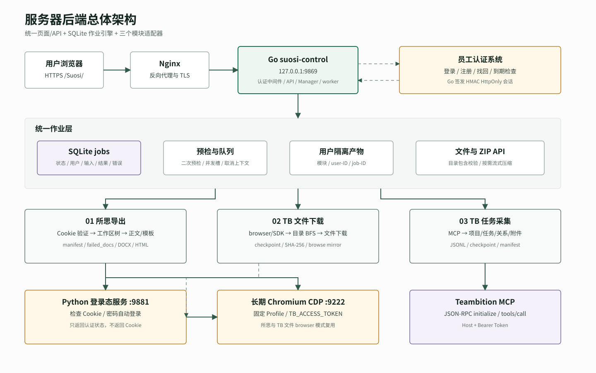
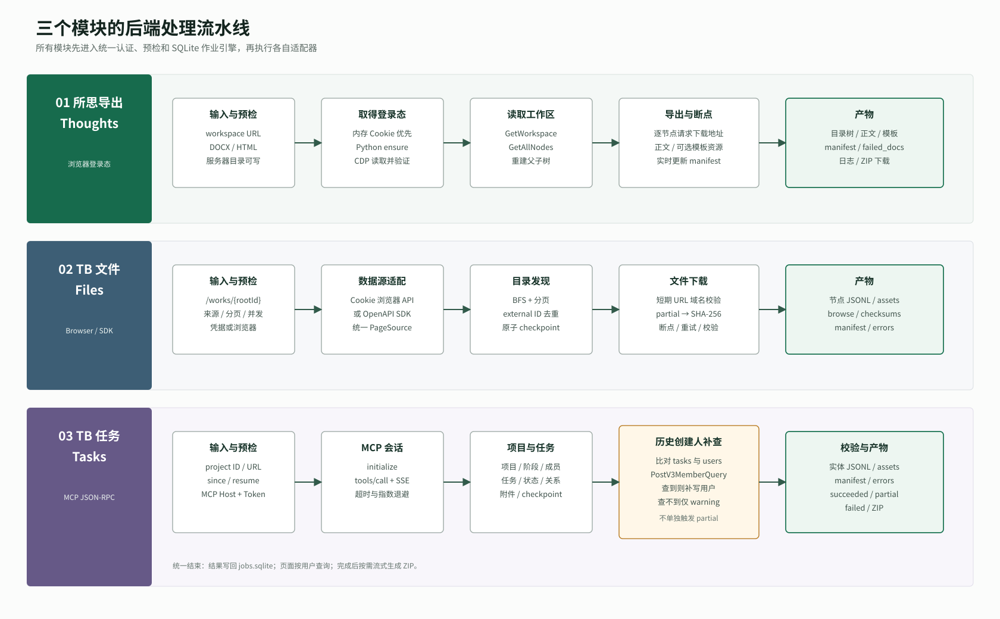

# 所思 / TB 文件 / TB 任务：服务器后端处理链路

> 文档基于 2026-08-18 已部署到服务器的代码版本整理。本文只描述当前真实实现，不包含尚未接入的规划功能。配置项只列变量名，不记录账号、密码、Token 或 Cookie 值。

## 1. 部署快照

| 项目 | 当前值 |
|---|---|
| 公网入口 | `https://43.142.31.198/Suosi/` |
| Nginx 上游 | `127.0.0.1:9869` |
| Go 进程 | PM2 进程 `suosi-control` |
| Go 程序目录 | `/www/wwwroot/suosi-control/` |
| Go 二进制 | `/www/wwwroot/suosi-control/runtime/bin/suosi-control` |
| SQLite 作业库 | `/www/wwwroot/suosi-control/runtime/data/jobs.sqlite` |
| 作业产物根目录 | `/www/wwwroot/suosi-control/runtime/artifacts/` |
| Python TB 登录态服务 | `127.0.0.1:9881` |
| 长期 Chromium CDP | `127.0.0.1:9222` |
| TB 环境配置 | `/www/wwwroot/suosi-control/.teambition.env`，权限 `600` |
| 员工认证 API | `AUTH_API_BASE_URL` 指向已有员工系统 API |



## 2. 统一请求与作业链路

三个模块共用同一套页面、HTTP API、认证中间件、SQLite 作业表和异步执行器。模块之间只在预检和 `run` 适配器之后分流。

### 2.1 从浏览器到后台任务

1. 用户访问 `/Suosi/`，Nginx 将请求转发到 Go 服务 `127.0.0.1:9869`。
2. 登录、注册、找回密码请求由 Go 转发到员工认证系统；Go 不直接打开员工数据库。
3. 登录成功后，Go 签发 `suosi_control_session`：HMAC 签名、`HttpOnly`、默认有效期 8 小时。
4. 每次受保护的 API 请求先校验本地签名会话，再调用员工系统的 `check-session`，确保实习生到期后不能继续使用。
5. 页面调用 `POST /api/preflight`。预检只检查输入、服务器归档目录和模块凭据，不执行爬取。
6. 页面调用 `POST /api/jobs`。后端再次预检，通过后生成作业 ID，并写入 SQLite。
7. 作业进入 worker 槽位，状态由 `queued` 变为 `running`，再由模块适配器执行实际采集。
8. 产物写入按“模块 / 用户 / 作业”隔离的目录；作业结果、错误和时间写回 SQLite。
9. 前端轮询 `GET /api/jobs` 或 `GET /api/jobs/{id}` 展示状态。
10. 作业完成后，`GET /api/jobs/{id}/download` 现场流式生成 ZIP。服务器不会预先保存一份重复 ZIP。

### 2.2 用户隔离

作业产物路径固定为：

```text
runtime/artifacts/<module-id>/user-<employee-id>/<job-id>/
```

三个模块对应：

```text
runtime/artifacts/thoughts-export/user-<id>/<job-id>/
runtime/artifacts/tb-files/user-<id>/<job-id>/
runtime/artifacts/tb-tasks/user-<id>/<job-id>/
```

任务列表、任务详情、文件浏览、单文件下载、ZIP 下载和取消任务都会带当前员工 ID 查询。用户不能通过修改 URL 读取其他用户的作业。

### 2.3 作业状态

```text
queued -> running -> succeeded
                  -> partial
                  -> failed
                  -> cancelled
```

- `succeeded`：核心采集完成，未出现会影响完整性的错误。
- `partial`：产物可用，但存在下载失败、源接口失败、目录不可见或实体引用不完整等问题。
- `failed`：模块返回错误，或实体校验发现结构性错误。
- `cancelled`：用户取消或服务关闭时上下文被取消。
- 服务启动时如果发现遗留的 `queued/running/cancelling`，会标记为“服务重启导致中断”，不会伪装成完成。



## 3. 模块一：所思导出

### 3.1 输入与预检

主要输入：

| 字段 | 含义 |
|---|---|
| `url` | `https://thoughts.teambition.com/workspaces/...` |
| `format` | `docx` 或 `html` |
| `overwrite` | 是否覆盖已有文件 |
| `include_templates` | 是否同时导出知识库模板 |
| `dry_run` | 只生成目录树，不下载正文 |
| `retry_failed` | 是否重试历史失败项 |

预检内容：服务器归档目录可写、URL 域名与路径合法、正文格式合法。自动登录账号是否配置只形成提示，不在预检阶段启动浏览器。

### 3.2 登录态取得

入口是 `thoughtsSession.Acquire`，同一进程内通过互斥锁串行处理登录态，避免多个任务同时操作共享浏览器。

处理顺序：

1. 优先使用 Go 内存中上一次验证成功的 Cookie。
2. 用轻量的 `GetWorkspace` 请求验证 Cookie；失效则清空内存缓存。
3. 服务器配置了 `TEAMBITION_AUTH_URL` 时，Go 调用 Python 服务 `/session/ensure`。
4. Python 服务连接长期 Chromium CDP，先检查是否存在 `TB_ACCESS_TOKEN`。
5. Cookie 存在则直接复用；不存在则使用服务端 TB 账号密码打开密码登录页、填写表单、勾选协议并登录。
6. 遇到验证码、扫码或安全验证时返回“需要人工验证”，不会无限等待。
7. Python 只返回“认证是否成功”，不会把 Cookie 返回给 Go。
8. Go 再通过 CDP 连接同一 Chromium，读取 Teambition 域 Cookie，并用所思工作区 API 验证。
9. 验证成功的 Cookie 只保存在 Go 进程内存中，供后续所思任务复用。

### 3.3 正文导出

1. 从 URL 提取 workspace ID。
2. 携带已验证的 Cookie 调用所思 API，读取工作区信息。
3. 如果工作区暂时禁止导出，尝试开启导出权限；任务结束时通过 `defer` 恢复原状态。
4. 获取全部节点，按父子关系重建知识库目录树。
5. 输出目录按“组织名 / 知识库名”建立，文件名过滤 Windows/Linux 非法字符。
6. 深度遍历节点；每个节点请求 DOCX 或 HTML 下载地址，失败时尝试详情接口作为回退。
7. 每个节点完成后立即更新 `manifest.json`，失败项写入 `failed_docs.json`，支持覆盖、跳过和失败重试。
8. `dry_run=true` 时只输出 `dry_run_tree.txt`。

### 3.4 模板导出

启用 `include_templates` 后：

1. 查询当前知识库绑定的模板列表。
2. 获取模板预览结构。
3. 解析正文区块、附件、图片和外部链接。
4. 生成模板 HTML、DOCX、资源目录和链接/资源清单。
5. 写入模板 manifest，并执行文件存在性、SHA-256 和链接一致性校验。

### 3.5 主要产物

```text
<job-id>/
  logs/export_YYYYMMDD_HHMMSS.log
  <组织名>/<知识库名>/
    manifest.json
    failed_docs.json
    dry_run_tree.txt              # 仅 dry-run
    <目录和正文文件>
    templates/                    # 可选
      templates_manifest.json
      <模板目录>/
        assets/
        *.html
        *.docx
```

### 3.6 当前边界

- 所思与 TB 文件浏览器模式共用服务器长期 Chromium 登录态，但所思在 Go 内另有内存 Cookie 缓存。
- Cookie 不写入 SQLite、manifest 或普通日志。
- 单个正文节点失败会记录到 manifest 并继续处理其他节点；工作区读取、登录或目录读取失败会使整个作业失败。

## 4. 模块二：TB 文件下载

### 4.1 输入与预检

| 字段 | 含义 |
|---|---|
| `project_url` | 必须包含 `/project/{id}/works/{rootId}` |
| `source` | `browser` 或 `sdk` |
| `concurrency` | 下载并发，1 到 8 |
| `page_size` | 每页数量，10 到 200 |
| `max_file_size` | 单文件大小上限，0 表示不限 |
| `download_assets` | 是否下载文件本体 |
| `resume` | 是否复用断点 |
| `include_raw` | 是否保存脱敏原始响应 |
| `retry_failed` | 是否重试历史失败下载 |

浏览器模式检查 Chrome/Edge；SDK 模式检查 `TB_APP_ID`、`TB_APP_SECRET` 和 `TB_ORG_ID`。

### 4.2 数据源适配

浏览器模式：

1. 调用 Python 登录态服务确保长期 Chromium 已登录。
2. Go 通过 `TEAMBITION_CDP_URL` 连接 Chromium。
3. 导航到项目文件库页面，读取 `TB_ACCESS_TOKEN` 等 Teambition Cookie。
4. 使用 Cookie 请求 `/api/collections` 和 `/api/works`。
5. 下载前请求 `/api/works/{id}` 获取经过身份核验的短期下载地址。

SDK 模式：

1. 使用服务端 OpenAPI 凭据初始化 SDK Client。
2. 通过 SDK 获取目录、文件列表和下载信息。

两种模式在 `fileadapters` 后统一成 `PageSource + DownloadSource`，后面的发现、下载、断点和产物结构完全一致。

### 4.3 目录发现

1. 从 URL 提取项目 ID 和文件库根目录 ID。
2. 创建一个根目录占位节点，因为列表接口不返回根节点完整元数据。
3. 使用队列广度遍历目录；每个目录分别分页读取子目录和文件。
4. 以 Teambition external ID 去重，检测分页循环和重复节点。
5. 每页完成后原子更新 `checkpoints/file_discovery.json`。
6. 可选原始响应在落盘前移除 Cookie、签名参数和敏感 URL 信息。
7. 对父子引用、节点类型和 JSONL 结构做校验。
8. 目录不可访问时记录 `errors.jsonl`，将对应节点标为 `partially_visible`，继续处理其他目录。

### 4.4 文件下载

1. 读取发现阶段的 `project_file_nodes.jsonl`。
2. 加载 `checkpoints/file_downloads.json`。
3. 已下载且本地文件大小、SHA-256 仍匹配的文件直接跳过。
4. 历史失败项只有在 `retry_failed=true` 时重新尝试。
5. 通过 worker 池并发解析短期下载 URL，并校验 URL 只能属于 Teambition 可信域名。
6. 文件先写入 `.partial`，成功后按内容 SHA-256 存入 `assets/sha256/`。
7. 每个文件完成后更新下载 checkpoint、节点状态和错误记录。
8. 最后生成按原目录结构浏览的镜像、manifest 和 `checksums.sha256`。

### 4.5 主要产物

```text
<job-id>/teambition-file-collector/<project-id>/
  manifest.json
  checksums.sha256
  errors.jsonl
  download_errors.jsonl
  checkpoints/
    file_discovery.json
    file_downloads.json
  entities/
    project_file_nodes.jsonl
    project_file_versions.jsonl
    project_file_references.jsonl
  assets/
    sha256/<content-hash>
  browse/                         # 按项目目录结构组织的浏览镜像
  raw/                            # include_raw=true 时存在
```

### 4.6 状态判定

- 目录与文件完整、下载无失败：`succeeded`。
- 某些目录不可访问、父节点无法解析或部分文件下载失败：`partial`。
- 登录失败、根 URL 无效、发现接口整体失败、断点/manifest 无法写入或下载校验失败：`failed`。

## 5. 模块三：TB 任务采集

### 5.1 输入与预检

| 字段 | 含义 |
|---|---|
| `project` | 项目 ID 或 `/project/{id}/tasks/view/...` 地址 |
| `concurrency` | 采集并发，1 到 8 |
| `since` | 可选 RFC3339 更新时间下限 |
| `resume` | 是否复用断点 |
| `include_raw` | 是否保存原始 MCP 响应 |
| `download_assets` | 是否请求短期地址并下载任务关联文件 |

预检只确认项目输入合法，以及 `TEAMBITION_MCP_HOST`、`TEAMBITION_MCP_TOKEN` 已加载到 Go 进程。

### 5.2 MCP 通信

1. Go 向 `${TEAMBITION_MCP_HOST}/mcp` 发送 JSON-RPC。
2. Header 使用 `Authorization: Bearer ...`，Token 只来自服务器环境变量。
3. 首次调用先执行 `initialize`，协议版本为 `2024-11-05`。
4. 后续通过 `tools/call` 调用具体 Teambition MCP 工具。
5. 客户端兼容 JSON 和 SSE `data:` 响应。
6. 网络错误、429、502、503、504 使用指数退避重试；单次 HTTP 超时 45 秒。

### 5.3 项目上下文

采集器先获取：

- `QueryProjectsV3`：项目信息。
- `SearchTaskGroupsV3`：任务列表容器，仅保留原始信息。
- `SearchStagesV3`：阶段/看板列，规范化为 `task_groups`。
- `ListProjectMembersV3`：当前项目成员。
- `PostV3MemberQuery`：补充成员姓名、邮箱、工号、禁用/离职状态等资料。

阶段接口缺失时会生成明确标记的派生阶段，不会用任务标题伪造阶段名。

### 5.4 任务与关系

1. `SearchProjectTasksV3` 分页读取项目任务，包含归档任务。
2. 如果设置 `since`，过滤更新时间早于下限的任务。
3. 对每条任务调用 `QueryTaskV3` 获取详情。
4. 调用 `QueryTaskTfs` 补充任务状态名称。
5. 调用 `GetTaskLinksV3` 获取任务关联；任务类型规范化为任务关系，文件类型转入附件处理。
6. 调用 `GetTaskDependenciesV3` 获取阻塞/被阻塞关系。
7. 父任务 ID 转换为 `parent` 关系。
8. 每条任务完成后写入 checkpoint，`resume=true` 时跳过已经完成的 external ID。

当前合同明确不采集评论和活动轨迹，因此 manifest 中 `comments`、`activities` 为 `unavailable`，这不是运行错误。

### 5.5 关联文件

1. 从任务链接中提取文件 resource ID。
2. 使用 `BatchGetFileDetails` 批量获取名称、大小、MIME 和存储键。
3. `download_assets=false` 时只写附件元数据，并标记需要短期下载地址。
4. `download_assets=true` 时要求 MCP 返回 600 秒短期签名地址，下载文件并计算 SHA-256。
5. 下载失败写入 `errors.jsonl`，任务主体仍保留，因此通常表现为 `partial`。

### 5.6 历史创建人补查

这是当前部署版本新加入的链路：

1. 任务全部落盘后，扫描 `tasks.jsonl` 中的 `creator_external_user_id`。
2. 与当前 `users.jsonl` 比较，找出不在当前项目成员列表中的创建人。
3. 再次调用 `PostV3MemberQuery`，并设置 `isDisable=all`，尝试查询历史、离职或禁用成员。
4. 查询成功的用户写入 `users.jsonl`，并标记来源为历史创建人补查。
5. API 仍查不到时，在 manifest 中记录：

   ```text
   historical creator profile unavailable: <user-id>
   ```

6. 该警告被视为可接受的历史引用，不会单独将任务降级为 `partial`。
7. 如果补写用户文件本身失败，仍按真实写入错误处理，不会被降级规则掩盖。

### 5.7 实体校验与状态

校验内容包括：JSON 是否有效、external ID 是否为空或重复、任务阶段引用、附件任务引用、任务关系目标引用。

- 任务列表接口整体失败或发现结构性实体错误：`failed`。
- 某条任务详情、关系、状态或附件接口失败：`partial`，并写入 `errors.jsonl`。
- 只有无法查询的历史创建人：保留 warning，但结果为 `succeeded`。
- 无错误、无影响完整性的校验警告：`succeeded`。

### 5.8 主要产物

```text
<job-id>/teambition-collector/<project-id>/
  manifest.json
  errors.jsonl                    # 有源调用错误时存在
  checksums.sha256
  checkpoints/checkpoint.json
  entities/
    projects.jsonl
    task_groups.jsonl
    users.jsonl
    tags.jsonl
    tasks.jsonl
    task_relations.jsonl
    attachments.jsonl
  assets/<task-id>/...            # download_assets=true 时可能存在
  raw/                            # include_raw=true 时存在
```

## 6. 三类认证不能混用

| 认证 | 服务对象 | 保存位置 | 使用模块 |
|---|---|---|---|
| 员工登录会话 | 本页面访问控制 | 浏览器 `HttpOnly` 签名 Cookie；员工数据仍在原认证系统 | 全部页面/API |
| Teambition 浏览器登录态 | `TB_ACCESS_TOKEN` 等 Cookie | 长期 Chromium Profile；Go 仅临时读取 | 所思、TB 文件 browser 模式 |
| TB OpenAPI 凭据 | App ID/Secret/Org ID | 服务器环境变量 | TB 文件 sdk 模式 |
| TB MCP 凭据 | MCP Host/Token | 服务器 `.teambition.env` 和进程环境 | TB 任务 |

安全边界：

- 登录密码、MCP Token、OpenAPI Secret 和 Cookie 不进入作业输入、SQLite、manifest 或页面。
- Python 登录态服务、Chromium CDP 和 Go 上游都只监听 `127.0.0.1`。
- Nginx 是唯一公网入口，负责 HTTPS 和 `/Suosi/` 路由。
- 下载文件接口执行路径清理和目录包含校验，拒绝 `..`、绝对路径和符号链接穿越。
- ZIP 只包含当前登录员工自己的作业目录。

## 7. API 与职责

| API | 后端职责 |
|---|---|
| `POST /api/auth/login` | 转发员工登录并签发本地签名会话 |
| `POST /api/auth/register` | 为已有员工设置/更新密码 |
| `POST /api/auth/recover` | 验证身份并找回密码 |
| `GET /api/auth/session` | 校验本地会话和员工系统远端状态 |
| `POST /api/auth/logout` | 清除登录 Cookie |
| `GET /api/modules` | 返回三个模块元数据 |
| `POST /api/preflight` | 输入、目录和凭据预检 |
| `POST /api/jobs` | 再次预检、创建并异步执行作业 |
| `GET /api/jobs` | 当前用户最近作业 |
| `GET /api/jobs/{id}` | 当前用户作业详情 |
| `POST /api/jobs/{id}/cancel` | 取消排队或执行中的作业 |
| `GET /api/jobs/{id}/files` | 列出当前用户作业产物 |
| `GET /api/jobs/{id}/files/{path}` | 下载单个产物文件 |
| `GET /api/jobs/{id}/download` | 流式生成并下载整个作业 ZIP |

## 8. 代码入口索引

| 责任 | 代码位置 |
|---|---|
| 服务启动与端口参数 | `main.go` |
| HTTP API、认证中间件、ZIP | `internal/control/server.go` |
| 员工认证与签名会话 | `internal/control/auth.go` |
| SQLite 作业引擎 | `internal/control/store.go` |
| 三模块预检、调度和适配 | `internal/control/manager.go` |
| 所思登录态复用 | `internal/control/thoughts_session.go` |
| 所思正文导出 | `libs/logic/export.go` |
| 所思浏览器登录 | `libs/logic/getcookie.go` |
| Python 登录态服务 | `scripts/teambition_auth.py` |
| TB 浏览器会话 | `internal/tbweb/browser.go` |
| TB 文件数据源适配 | `internal/teambition/fileadapters/` |
| TB 文件目录发现 | `internal/teambition/filecollector/discover.go` |
| TB 文件下载与断点 | `internal/teambition/filecollector/download.go` |
| MCP JSON-RPC 客户端 | `internal/teambition/taskprobe/client.go` |
| TB 任务实体采集 | `internal/teambition/collector/collector.go` |

## 9. 运维判断顺序

出现任务问题时建议按以下顺序检查：

1. 页面预检失败：先看输入格式和对应环境变量是否进入 PM2 进程。
2. 所思/TB 文件显示登录失败：检查 `9881/health`、`9222/json/version` 和 Chromium Profile。
3. TB 任务预检通过但执行失败：检查 MCP `initialize`，再看任务目录的 `errors.jsonl`。
4. 状态为 `partial`：先读模块 manifest，再按 external ID 定位 `errors.jsonl` 或 `download_errors.jsonl`。
5. 页面能看到任务但无法下载：确认作业属于当前员工、状态为 `succeeded/partial`，并检查产物目录权限。
6. 服务重启后任务失败：SQLite 中会明确记录 `interrupted`，需重新提交，不会自动续跑旧进程中的 goroutine。
